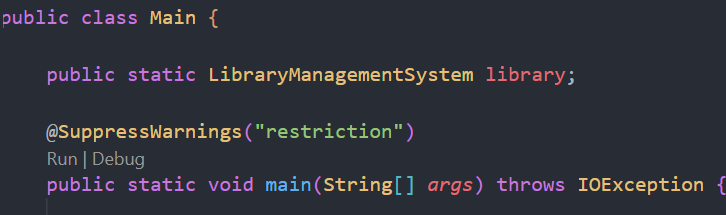
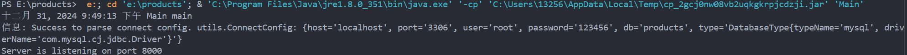
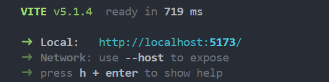
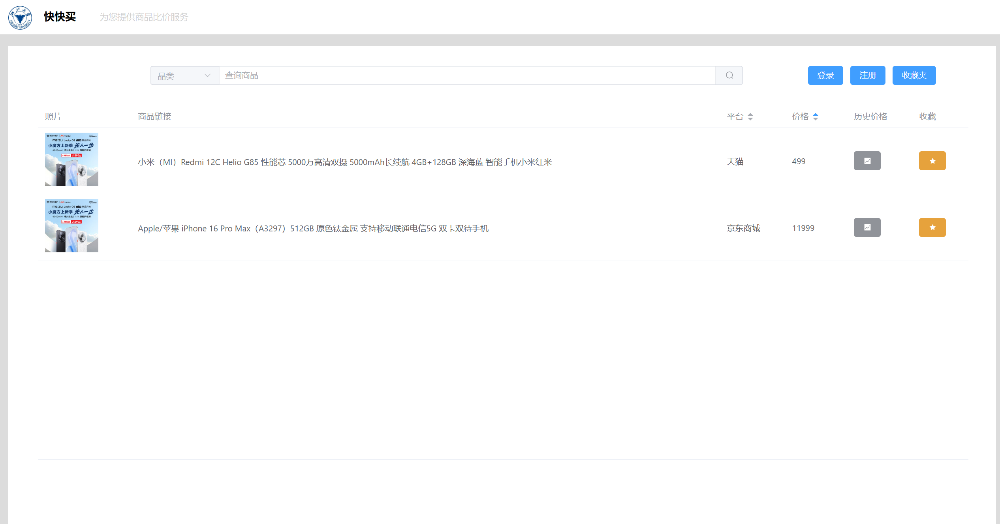

# 快快买 - 一个商品比价网站

### 支持 京东，淘宝，唯品会 三个平台的所有商品

### 注意事项

1. *下载 chromedriver*
    
    在chrome浏览器，输入chrome://version, 查看下自己chrome浏览器对应的版本

    在[chromedriver官方下载页面](https://googlechromelabs.github.io/chrome-for-testing/)下载你对应的 chromedriver 安装后，配置好环境变量

    ```java
    System.setProperty("webdriver.chrome.driver", "C:\\Program Files\\Google\\Chrome\\Application\\chromedriver.exe");
    String userDataDir = "E:\\chrome_userdata"; // 修改为你自己的用户数据目录路径
    ```

    在 products\products-backend\src\main\java\Main.java 里将上述两个路径分别改为你的 chromedriver 的安装路径（推荐放在 chrome 同一目录下），你自己的用户数据目录（用来存放你的 chrome 用户数据，可随意更改，若没有则新建一个）

2. *登录三个平台*

    在第一次获取数据时为未登录状态，打开的 chrome 浏览器会自动阻塞来等待你登录三个平台，若因为平台原因无法登录请参考 products\products-backend\src\main\java\Main.java：174 ，后续不需要再次登录

3. *配置mysql*

    请在 products\products-backend\src\main\resources\application.yaml 中配置 mysql 相关信息

    执行 products\products-backend\src\main\resources\db4mysql.sql

    ```sql
    drop table if exists `user`;
    drop table if exists `goods`;
    drop table if exists `historygoods`;
    drop table if exists `collectgoods`;

    create table `user` (
        `user_id` int not null auto_increment,
        `user_name` varchar(63) not null,
        `password` varchar(63) not null,
        `email` varchar(63) not null,
        primary key (`user_id`),
        unique (`user_name`)
    ) engine=innodb charset=utf8mb4;

    create table `goods` (
        `goods_id` int not null auto_increment,
        `sku_id` varchar(127) not null,
        `goods_name` varchar(127) not null,
        `goods_link` varchar(512) not null,
        `img_url` varchar(512) not null,
        `price` decimal(7, 2) not null default 0.00,
        `platform` varchar(63) not null,
        primary key (`goods_id`)
        unique (`sku_id`),
    ) engine=innodb charset=utf8mb4;

    create table `historygoods` (
        `goods_id` int not null auto_increment,
        `sku_id` varchar(127) not null,
        `goods_name` varchar(127) not null,
        `goods_link` varchar(512) not null,
        `img_url` varchar(512) not null,
        `price` decimal(7, 2) not null default 0.00,
        `platform` varchar(63) not null,
        primary key (`goods_id`)
    ) engine=innodb charset=utf8mb4;

    create table `collectgoods` (
        `collect_id` int not null auto_increment,
        `goods_id` int not null,
        `user_id` int not null,
        `sku_id` varchar(127) not null,
        `goods_name` varchar(127) not null,
        `goods_link` varchar(512) not null,
        `img_url` varchar(512) not null,
        `price` decimal(7, 2) not null default 0.00,
        `platform` varchar(63) not null,
        primary key (`collect_id`),
        foreign key (`goods_id`) references `goods`(`goods_id`) on delete cascade on update cascade,
        foreign key (`user_id`) references `user`(`user_id`) on delete cascade on update cascade
    ) engine=innodb charset=utf8mb4;
    ```

4. *启动后端*

    若你安装了java相关插件，推荐通过插件自带的图标来启动

    

    若没有相关插件，请运行如下指令

    ```shell
    mvn clean compile
    // 非 Windows
    mvn exec:java -Dexec.mainClass="Main" -Dexec.cleanupDaemonThreads=false
    // Windows
    mvn exec:java -D"exec.mainClass"="Main" -D"exec.cleanupDaemonThreads"=false
    ```

    后端正常启动后如下图，监听8000端口

    

5. *启动前端*

    在 products\products-frontend 执行如下指令

    ```shell
    npm install
    npm run dev
    ```

    前端正常启动后如下图，监听5173端口

    

    